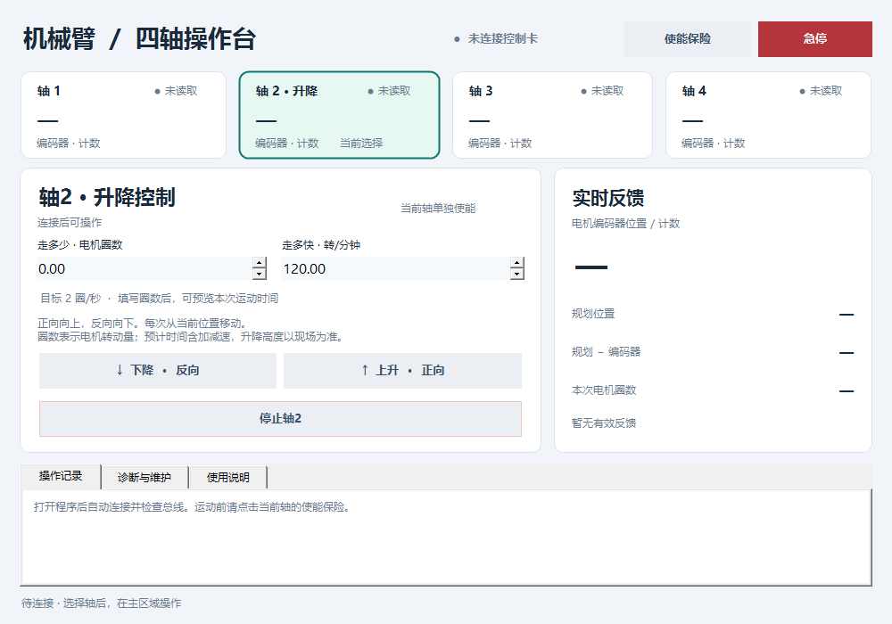

# 机械臂四轴操作台 · Robotic Arm Lab

**交接入口，更新于 2026-10-10。** 当前维护的是 Windows 上的 C# WinForms 四轴操作台，通过博派 EtherCAT 控制卡控制四个软件轴。当前 App 为“使能保险版”，基于输入修复版继续修订；原应用代码基线是 [`ac636ff`](https://github.com/ZZZZihan/robotic-arm/commit/ac636ff8fe91201a5976f294febd556085f8bbb4)。

轴2是丝杆升降轴，现场操作者已确认 **正向向上、反向向下**。界面用电机圈数控制轴2的相对移动；圈数和转速支持直接键入、Ctrl+A 重填和上下按钮微调。轴1、3、4保留点动和原来的绝对定位入口。



> 这张图是离线界面检查的渲染结果，不表示当前设备状态。程序启动自动连接并检查总线；已有总线复用，只有0从站且四轴未使能、静止无危险状态时才尝试一次初始化。使能与运动由操作者点击保险及运动按钮。软件急停依赖通信，现场物理急停仍须可用。

## 1. 接手先读什么

| 目的 | 入口 |
| --- | --- |
| 先理解当前版本、构建和运行 | 本 README |
| 查看现场已知配置、程序结构、排障和待办 | [交接说明](docs/HANDOFF.md) |
| 查看具体界面用法和轴2修复记录 | [操作台使用说明](thinkbook-deploy/payload/source/EtherCATDemo/README-dashboard.md) |
| 查控制卡、SV630N、SDK 与原始示例 | [资料目录与手册导航](materials/README.md) |
| 复核已执行的构建、测试及现场反馈边界 | [使能保险版交付记录](docs/verification/2026-10-09-enable-insurance.md)、[输入修复版历史验证记录](docs/verification/2026-10-09-dashboard.md) |
| 了解资料来源、同步范围和版权归属 | [仓库范围](docs/REPOSITORY_SCOPE.md)、[第三方资料说明](materials/NOTICE.md) |

## 2. 当前做到哪里

| 项目 | 当前结论 | 证据性质 |
| --- | --- | --- |
| 四轴可以运动 | 操作者曾明确反馈“四个都能动” | 用户现场反馈，不是自动验收 |
| 轴2此前不升降 | 操作者确认丝杆脱落，并已修复 | 用户现场反馈；编码器变化本身不能证明机构移动 |
| 轴2方向 | 正向上升、反向下降 | 用户现场确认，已映射到按钮与提示 |
| 最新操作台构建 | Windows x64 Release 构建通过 | 实际构建 |
| 运动核心检查 | 20 项通过 | 假适配器测试，不连接 SDK/控制卡 |
| 初始化与保险检查 | 33 项通过 | 假适配器检查，未接硬件 |
| 界面与输入检查 | 22 组通过，包括保险/急停、点动松手与失联处理、键盘输入 | Windows 离线界面回归 |
| 使能保险版现场体验 | 等待操作者使用该版本确认 | 尚未完成最新版本的实机验收 |
| 毫米换算、软限位、回零与完整机械标定 | 未完成 | 不得把电机圈数当成升降毫米 |

接手当天仍需确认实际运行的程序和设备状态。9 月的网页诊断工具、早期圈数测试版和最新桌面操作台是不同版本，不能用旧报告替代当日状态。

## 3. 从仓库构建：不需要连接机械臂

### 环境

- Windows x64；当前验证机是 ThinkBook。
- Windows PowerShell 5.1。
- Visual Studio 2019 Build Tools / MSBuild，以及能构建 **.NET Framework 4.0 Client Profile** 的目标程序集。项目不是 .NET 6/8 应用，只有 `dotnet` CLI 不足以说明环境可构建。
- 三份匹配的厂商 x64 DLL 已随仓库放在 [`materials/sdk/bopai-ethercat-x64/`](materials/sdk/bopai-ethercat-x64/)，构建脚本按 SHA-256 校验；不需要从本机旧解包目录寻找依赖。

### 命令

本次交接分支为 `codex/handoff-enable-insurance-20261010`。在该分支合入 `main` 前，请在 Windows PowerShell 中按以下命令取得本版：

```powershell
git clone --branch codex/handoff-enable-insurance-20261010 https://github.com/ZZZZihan/robotic-arm.git
cd robotic-arm
powershell.exe -NoProfile -File .\thinkbook-deploy\scripts\build-dashboard.ps1
```

脚本只做以下事情：校验 SDK、复制维护源码到一个新输出目录、构建操作台、执行 20 项运动核心检查、33 项初始化与保险检查和 22 组离线界面检查。它**不会启动操作者 App、连接控制卡、修改网卡或更新桌面快捷方式**。

默认输出目录是 `.artifacts\dashboard-<时间戳>\`，包含：

```text
app/                       CSharpDemo.exe + 三份 SDK DLL
source/EtherCATDemo/        本次实际构建的源码快照
verification/              测试程序、结果文本、离线界面截图
verification-result.json   构建结果、检查数、EXE 与 SDK 校验值
```

需要指定工具或输出位置时：

```powershell
.\thinkbook-deploy\scripts\build-dashboard.ps1 `
  -MSBuildPath 'C:\实际路径\MSBuild.exe' `
  -OutputDirectory 'C:\RobotArmDemo\releases\my-new-build'
```

输出目录必须尚不存在，避免覆盖现场正在运行的程序。脚本不改变系统执行策略；若被组织策略拦截，请按本单位的软件执行规范处理。

**请使用 `build-dashboard.ps1`。** 早期 `prepare.py` 会从本机厂商包重建文件，`scripts/build.ps1` 是旧打包流程入口；它们不用于当前维护版操作台的构建。原始厂商示例也不是当前 App。

## 4. 现场运行与版本切换

ThinkBook 上已交付的使能保险版（记录见 [使能保险版交付记录](docs/verification/2026-10-09-enable-insurance.md)）：

- 桌面入口：**机械臂-四轴操作台**。
- 窗口标题：**机械臂 · 四轴操作台 · 使能保险版**。
- 发布路径：`C:\RobotArmDemo\releases\four-axis-insurance-20261009-180249\built\app\CSharpDemo.exe`。
- 该次 EXE SHA-256：`923A82EFA30DBE292FD17218445FEABC01626AF31767D960F642420C29ECFDB2`。重新构建的 EXE 不要求与此二进制哈希相同；应记录各自源码和构建结果。

发布路径是 2026-10-09 的交付记录，不保证以后仍是桌面入口。确认快捷方式目标和窗口标题后再操作。

1. 四轴停止、升降负载可靠保持时，正常关闭旧控制程序。**同一时刻只运行一个控制程序**，旧 Demo、网页服务与新 App 会争用 UDP 60000。
2. 使用已有桌面入口，或把新构建的整个 `app` 文件夹放到一个新的发布目录，再手动打开其中的 `CSharpDemo.exe`。不要只复制 EXE，也不要覆盖运行中的版本。
3. 打开后等待自动连接和总线检查完成，看新的四轴反馈与诊断状态；异常时运动保持锁定，不自动反复初始化或清故障。
4. 选择轴卡片，点击“使能保险”，仅使能当前轴，等待新的使能反馈。原有使能状态不会替代本次人工保险，切换轴需重新点击。
5. 根据剩余行程填写参数，再点击运动按钮。普通停止保留；红色“急停”请求停止全部运动并锁存保险。急停后确认停止、排除异常再人工重新打开保险；完成后同时核对反馈和实际机构。

回滚时，同样先停稳并正常关闭程序，再打开原发布目录，或把快捷方式目标改回旧目录。仓库构建脚本不会删除旧版本。

## 5. 轴2的单位和操作

| 项目 | 含义 |
| --- | --- |
| ↑ 上升 · 正向 | 从当前规划位置加本次电机圈数对应的增量 |
| ↓ 下降 · 反向 | 从当前规划位置减本次增量 |
| 走多少 | 电机圈数，初始 0；实际启动要求大于 0、最多 10 圈，最多两位小数 |
| 走多快 | 0.01～120 转/分钟，默认 120；120 转/分钟对应目标匀速 2 电机圈/秒 |
| 预计时间 | 包含沿用 Demo 的加减速；短行程可能到不了目标转速 |
| 编码器位置 | 电机反馈计数，不是升降高度 |
| 本次电机圈数 | 本次启动前编码器基准以来的增量；反馈中断后不继续沿用旧基准 |
| 停止轴2 | 请求停止轴2，等待反馈确认；不会主动断使能 |

已核对并在启动前检查的换算配置为 **262144 计数/电机转、驱动电子齿轮 1:1、控制卡比例 1:1**。120 转/分钟换算为 `524.288 count/ms`。上述配置是程序预期，不能据此假定更换电机或修改驱动后仍然正确。

圈数可以直接键入，例如 `0.5`、`1`、`2.5`，也可用上下按钮微调。**回车只确认输入，不启动运动。** 清空、非法数字、超范围或超过两位小数时，界面保留文本供修正，并禁止轴2新运动；不会悄悄改成上限或使用旧数值。

10 圈是软件输入上限，不是机械安全行程。丝杆导程和传动比尚未形成完整标定，不能用圈数直接推算毫米。轴2运动中切走窗口会请求停止；关闭窗口时会先请求停止，需等有效停止反馈后再正常关闭。

轴1、3、4仍沿用旧 Demo：按住点动、松开停止，点动速度为 `20 count/ms`；两个定位按钮是到 `-100000 / +100000` 计数的**绝对位置**，不是移动这些计数的相对步长。其点动释放与“停止全部运动”的作用范围是全部轴，见[交接说明](docs/HANDOFF.md)。

## 6. 常见问题

| 现象 | 先检查什么 |
| --- | --- |
| 只能点上下箭头，不能顺畅键入圈数 | 窗口标题是否为“使能保险版”（已包含输入修复）；旧版本会在刷新时把未完成的 `0.` 改成 `0.00` |
| 提示 UDP 60000 被占用 | 是否还有旧 Demo 或网页服务运行；先正常关闭旧程序，不同时抢占控制卡 |
| 已打开板卡但轴卡片无有效反馈 | 读取返回码、网卡地址、控制卡连接及总线状态；“打开成功”不等于四驱动可用 |
| 显示 `-1` 或 `-7` | 日志分别提示通信失败或控制器无响应；保留完整返回码和当时接法 |
| 从站为 0、站号为 -1 | 当前会话总线未就绪；不能把缓存的四轴数字当成有效状态，也不应直接重置零点 |
| 数值变化，但升降杆不动 | 同时检查实际机构。此次曾由操作者确认丝杆脱落；编码器变化不能排除机械传动脱开 |
| 停止后不能再启动 | 看使能、报警/限位、运动状态及规划—反馈差；停止不会自动重新使能或清故障 |
| 构建缺 DLL / BadImageFormatException | 使用仓库内同组 x64 DLL；不要混用其他示例的 32 位或旧版库 |
| MSBuild 提示目标框架引用缺失 | 检查 .NET Framework 4.0 目标程序集与桌面构建工具，保留原错误，不直接改目标框架掩盖问题 |

应用日志位于正在运行的 `app\logs\axis2-<时间戳>.log`。先记录程序路径、版本、轴号、参数、方向、时间和现场现象；再查 `PREFLIGHT`、`COMMAND`、`SAMPLE`、`STOP`。详细字段和限制见[交接说明](docs/HANDOFF.md)。

## 7. 目录与资料

```text
thinkbook-deploy/payload/source/EtherCATDemo/  当前维护的操作台与离线测试
thinkbook-deploy/scripts/build-dashboard.ps1 当前操作台离线构建入口
materials/manuals/                          两份核心手册
materials/sdk/bopai-ethercat-x64/             当前验证使用的三份 x64 DLL
materials/vendor-reference/EtherCATDemo/      原始厂商 C# 示例，仅作参考
materials/manifest.json                     来源、大小、SHA-256 清单
docs/HANDOFF.md                             交接和排障说明
docs/verification/                          整理后的验证记录
thinkbook-deploy/payload/reference/VCppDemo/  原有 C++ 参考源码
```

仓库中已保存的资料共约 **76 MiB**，主要体积来自 SV630N 手册。它们是项目原先使用的资料副本，原本地文件保留；不是重新从网上寻找的不确定版本。资料索引包含逐文件校验值与原始名称。2026-10-10 核对时仓库为公开状态，第三方资料的权利说明见 [NOTICE](materials/NOTICE.md)。

本机还保留早期网页诊断、Python 控制算法原型、课程、完整厂商包和原始现场记录，**并非全部纳入本次交接快照**。旧资料中的 `src/robot_arm_mvp`、旧 Web 终端和本机解包路径不能视为当前仓库已提供的构建依赖。需要接续这些独立方向时，应单独整理其源码和验收记录。

## 8. 下一位维护者先做什么

1. 用本仓库重新构建，保存 `verification-result.json`，确认 20 项核心检查、33 项保险检查、22 组界面检查通过。
2. 请现场操作者确认运行的是使能保险版，并实际验收键入圈数/转速、上升/下降和停止后再次启动的使用体验。
3. 补全四轴实体名称、方向、机械行程、零点、传动比、抱闸与急停/限位检查记录；未知项按未知记录，不从软件数字推断。
4. 确认导程和传动比后再设计毫米单位与软限位；不要先改换算常数试碰行程。
5. 后续代码改动沿用独立发布目录、SDK 校验和离线回归。实机动作需另外确认现场条件与操作者授权。

**尚不具备的能力：**完整机械标定、笛卡尔坐标控制、联动轨迹实机验收、可靠的独立安全控制器。不要把此手动操作台当成已经验收的生产机器人控制系统。
